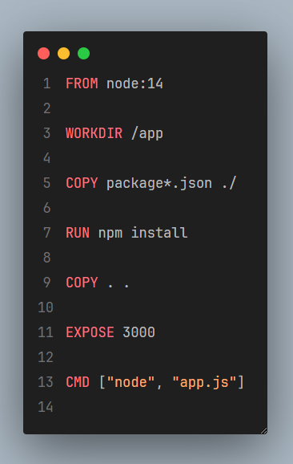
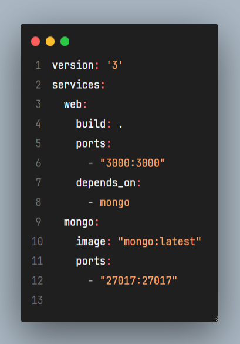

# Descrição
Foi criado um arquivo Dockerfile e Docker-Compose para colocar o Aplicativo e o banco de dados em um container para maior facilidade a agilidade de uso 

## DockerFile

## Docker Compose

